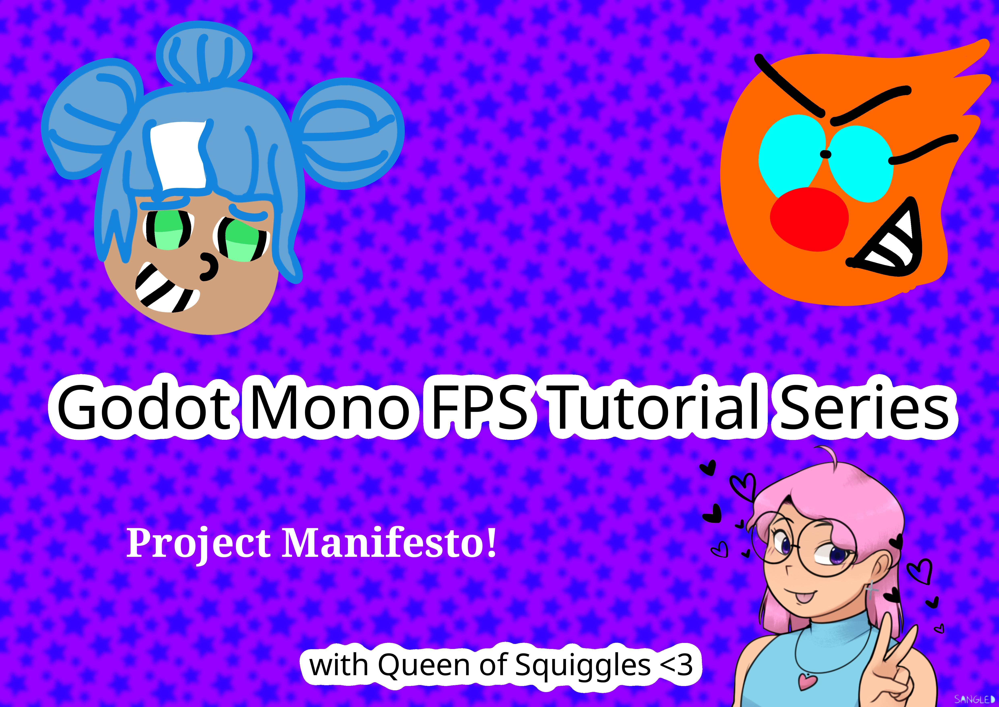

# Godot Mono FPS Tutorial

This is the repository for my tutorial series.

This main branch will contain the latest developments with one branch per episode.

The naming scheme for branches is ep# where the # is the episode number. For example ep1 for the first, ep5 for the fifth, and so on.

That should make it easy to grab the code from a specific point if you like.
